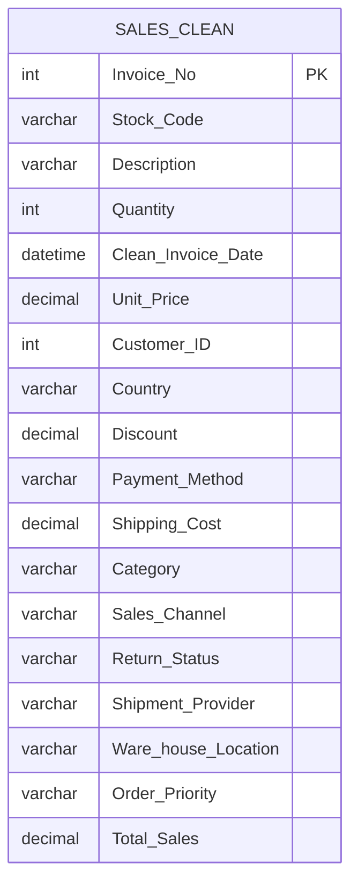

# Online Sales Data Cleaning & Analysis

> A full end-to-end data project that takes a messy 49,782-row transactional sales CSV riddled with missing values, invalid records, inconsistent spellings, and broken date formats and transforms it into a clean, query-ready dataset. Business insights were extracted via SQL and surfaced through an interactive Excel dashboard.

---

## ⚙️ Project Type Flags

- [x] Exploratory Data Analysis (EDA)
- [x] SQL Analysis / Querying
- [x] Dashboard / Data Visualization
- [x] Data Cleaning / Wrangling
- [x] End-to-End (multiple of the above)

---

## Table of Contents

1. [Project Overview](#1-project-overview)
2. [Objectives](#2-objectives)
3. [Project Scope & Tools](#3-project-scope--tools)
4. [Repository Structure](#4-repository-structure)
5. [Data Workflow](#5-data-workflow)
6. [Data Model & Schema](#6-data-model--schema)
7. [ERD - Entity Relationship Diagram](#7-erd--entity-relationship-diagram)
8. [Analysis & Metrics](#8-analysis--metrics)
9. [Key Insights](#9-key-insights)
10. [Recommendations](#10-recommendations)
11. [Assumptions & Limitations](#11-assumptions--limitations)
12. [Future Enhancements](#12-future-enhancements)
13. [Deliverables](#13-deliverables)
14. [Author](#14-author)

---

## 1. Project Overview

**Context:** Raw transactional sales data for an online retail business was available in CSV format but unusable for reliable reporting due to pervasive data quality issues missing customer records, negative prices and quantities, misspelled categorical values, and dates stored as plain text.

**Problem Statement:** How do you turn a fundamentally broken dataset into a trustworthy foundation for business analysis and what does the cleaned data actually reveal about product performance, channel effectiveness, return behaviour, and warehouse operations?

**Approach:** The raw CSV was ingested into a MySQL staging table, then a full data cleaning pipeline was written in SQL to detect, flag, and resolve each category of quality issue before business analysis queries were run on the clean table. Results were then brought into Excel for dashboard visualization and KPI reporting.

**Outcome:** A fully cleaned `sales_clean` table (derived from 49,782 raw rows), four SQL-driven business analyses, and an interactive Excel dashboard with 6 KPI cards, 6 charts, and 4 dynamic slicers.

---

## 2. Objectives

- **Primary Objective:** Clean and standardize a messy online sales dataset in SQL, producing a reliable table suitable for business analysis and reporting.
- **Secondary Objective 1:** Identify the top revenue-generating products and highest-performing sales channels.
- **Secondary Objective 2:** Quantify return behaviour and assess its implications for product quality and operational performance.
- **Secondary Objective 3:** Build an interactive Excel dashboard that enables dynamic filtering across country, category, payment method, and sales channel dimensions.

> 💡 *Every cleaning decision and analysis query in this project traces back to one of these objectives.*

---

## 3. Project Scope & Tools

### Scope

| Dimension | Details |
|-----------|---------|
| **In Scope** | All 49,782 rows of `online_sales_dataset.csv`; cleaning, transformation, and analysis of all 17 columns; Excel dashboard covering revenue, orders, returns, channels, products, and warehouse performance |
| **Out of Scope** | Customer-level demographic or behavioural segmentation (no demographic data in source); predictive modelling; marketing spend attribution |
| **Time Period** | Transaction dates as recorded in `Invoice_Date`; date range determined by the source dataset |
| **Granularity** | Transaction (invoice) level for cleaning; aggregated to product, channel, country, and warehouse level for analysis |

### Tools & Technologies

| Category | Tool(s) Used |
|----------|-------------|
| Data Storage | MySQL (`online_sales_project` database) |
| Data Processing | SQL DDL for staging, DML for cleaning and transformation |
| Analysis | MySQL queries — aggregations, grouping, window-style percentage calculations |
| Visualization | Microsoft Excel PivotTables, PivotCharts, KPI cards, Slicers |
| Reporting | Microsoft PowerPoint |
| Version Control | Git / GitHub |
| Documentation | Markdown |

---

## 4. Repository Structure

```
online-sales-analysis/
│
├── data/
│   ├── raw/                            # Original online_sales_dataset.csv — never edited
│   └── processed/                      # Exported sales_clean table (CSV)
│
├── queries/
│   ├── transformations/
│   │   ├── 01_database_setup.sql       # Database and staging table creation
│   │   ├── 02_data_cleaning.sql        # Full cleaning pipeline (missing values, invalid records, date conversion, revenue calc)
│   │   └── 03_data_transformation.sql  # Derived columns and final clean table
│   └── final/
│       ├── top_products.sql
│       ├── sales_channel_performance.sql
│       ├── return_analysis.sql
│       └── warehouse_performance.sql
│
├── reports/
│   └── Online_Sales_Project_Report.docx
│
├── visuals/
│   ├── dashboard_screenshot.png        # Excel dashboard
│   └── erd.png                         # Entity Relationship Diagram
│
├── docs/
│   └── data_dictionary.md              # Field definitions and data types
│
└── README.md                           # You are here
```

---

## 5. Data Workflow

```
[online_sales_dataset.csv — 49,782 rows, 17 columns]
              ↓
[Imported into MySQL → sales_staging table]
              ↓
[SQL Cleaning Pipeline → sales_clean table]
  - Null/blank warehouse locations → replaced with 'Unknown'
  - Rows with Quantity ≤ 0 → deleted
  - Rows with Unit_Price ≤ 0 → deleted
  - Misspelled Payment_Method values (e.g. 'paypall') → standardized
  - Out-of-range Discount values (< 0 or > 1) → reset to 0
  - Invoice_Date (text) → converted to DATETIME (Clean_Invoice_Date)
  - Total_Sales column → calculated as Quantity × Unit_Price × (1 - Discount)
              ↓
[SQL Business Analysis Queries on sales_clean]
  - Top products by revenue
  - Sales channel performance
  - Return rate analysis
  - Warehouse location performance
              ↓
[Export to Excel → PivotTables, PivotCharts, KPI Cards, Slicers]
              ↓
[Interactive Dashboard + Project Report (Word / PowerPoint)]
```

1. **Source:** `online_sales_dataset.csv` 49,782 rows, 17 columns, sourced as a raw transactional export. Loaded into MySQL as a staging table with all columns preserved in their original uncleaned state.

2. **Ingestion:** A `CREATE TABLE sales_staging` DDL script was used to define the schema, with `Invoice_Date` deliberately imported as `VARCHAR(50)` to avoid silent format-conversion errors during load.

3. **Cleaning:** Six categories of quality issues were resolved: (1) missing `Ware_house_Location` values filled with `'Unknown'`; (2) rows with `Quantity ≤ 0` deleted; (3) rows with `Unit_Price ≤ 0` deleted; (4) inconsistent `Payment_Method` spellings standardized (e.g. `'paypall'` → `'PayPal'`); (5) `Discount` values outside `[0, 1]` reset to `0`; (6) `Invoice_Date` converted from text to `DATETIME` using `STR_TO_DATE()`.

4. **Transformation:** Two new columns were added to `sales_clean`: `Clean_Invoice_Date` (parsed `DATETIME`) and `Total_Sales` (calculated revenue field: `Quantity × Unit_Price × (1 - Discount)`).

5. **Analysis:** Four SQL business analyses were conducted using `GROUP BY` aggregations, `COUNT(DISTINCT ...)`, `SUM()`, `ROUND()`, and percentage-of-total subqueries. Focus areas: product revenue ranking, sales channel comparison, return rate distribution, and warehouse performance.

6. **Output:** Cleaned dataset exported to Excel; interactive dashboard built using PivotTables, PivotCharts, KPI cards, and slicers. Final deliverables: project report (Word), SQL scripts, processed CSV, and dashboard file.

---

## 6. Data Model & Schema

### Dataset / Table: `sales_staging` → `sales_clean`

| Field Name | Data Type | Description | Example Value |
|------------|-----------|-------------|---------------|
| `Invoice_No` | INT | Unique invoice identifier per transaction | `536365` |
| `Stock_Code` | VARCHAR(50) | Product stock-keeping unit code | `85123A` |
| `Description` | VARCHAR(100) | Human-readable product name | `WHITE HANGING HEART T-LIGHT HOLDER` |
| `Quantity` | INT | Units sold per transaction; rows ≤ 0 removed during cleaning | `6` |
| `Invoice_Date` | VARCHAR(50) | Raw transaction date as text — retained in staging only | `01/12/2010 08:26` |
| `Clean_Invoice_Date` | DATETIME | Parsed and validated transaction datetime (added during cleaning) | `2010-12-01 08:26:00` |
| `Unit_Price` | DECIMAL(10,2) | Price per unit in local currency; rows ≤ 0 removed | `2.55` |
| `Customer_ID` | INT | Customer identifier — may be NULL | `17850` |
| `Country` | VARCHAR(100) | Customer's country of origin | `United Kingdom` |
| `Discount` | DECIMAL(10,4) | Discount applied as a decimal fraction; clamped to `[0, 1]` during cleaning | `0.05` |
| `Payment_Method` | VARCHAR(50) | Payment method used; spellings standardized during cleaning | `PayPal` |
| `Shipping_Cost` | DECIMAL(10,2) | Shipping charge for the order | `3.50` |
| `Category` | VARCHAR(50) | Product category | `Home Decor` |
| `Sales_Channel` | VARCHAR(50) | Platform through which the sale was made | `Online` |
| `Return_Status` | VARCHAR(50) | Indicates whether the item was returned | `Returned` |
| `Shipment_Provider` | VARCHAR(50) | Delivery carrier | `DHL` |
| `Ware_house_Location` | VARCHAR(100) | Originating warehouse; NULLs and blanks replaced with `'Unknown'` | `London` |
| `Order_Priority` | VARCHAR(20) | Urgency level of the order | `High` |
| `Total_Sales` | DECIMAL(12,2) | Calculated revenue field (added during cleaning): `Quantity × Unit_Price × (1 - Discount)` | `14.45` |

> **Row count (raw):** 49,782 rows
> **Row count (clean):** Reduced after deletion of invalid quantity/price rows
> **Key derived field:** `Total_Sales` the primary revenue metric used across all business analyses

---

## 7. ERD - Entity Relationship Diagram

This project uses a **single-table design**. All transaction attributes customer, product, order, and logistics are stored as columns within `sales_clean`. There are no foreign-key relationships to separate dimension tables.



> **Note:** A normalized version of this schema would separate `customers`, `products`, and `orders` into distinct tables joined on `Customer_ID`, `Stock_Code`, and `Invoice_No` respectively. This is flagged as a future enhancement.

---

## 8. Analysis & Metrics

### Analytical Approach

The analysis was exploratory and descriptive. Starting from the cleaned dataset, SQL queries were written to answer four pre-defined business questions — each targeting a different operational dimension: product performance, channel effectiveness, return behaviour, and warehouse contribution. No hypothesis testing or predictive modelling was applied; the goal was to surface patterns and ranking-level insights that a business team could act on directly.

### Key Metrics Defined

| Metric | Plain-Language Definition | Why It Matters |
|--------|--------------------------|----------------|
| `Total Revenue` | Sum of `Total_Sales` for a given group (product, channel, warehouse) | Primary measure of commercial performance across all dimensions |
| `Total Orders` | Count of distinct `Invoice_No` values within a group | Measures demand volume independent of transaction value |
| `Return Rate (%)` | Count of returned orders divided by total orders, expressed as a percentage | Proxy for product satisfaction and operational quality |
| `Average Order Value` | Total revenue divided by total number of distinct orders | Indicates customer spend intensity; surfaced as a KPI card in the dashboard |

### Methods Used

- Descriptive aggregation — `SUM()`, `COUNT()`, `ROUND()` across product, channel, country, and warehouse dimensions
- Top-N ranking — `ORDER BY ... DESC` with `LIMIT 10` for highest-revenue product analysis
- Percentage-of-total calculation — return rate computed using a correlated subquery against the full `sales_clean` row count
- PivotTable analysis in Excel cross-tabulation of revenue, orders, and categories with slicer-driven dynamic filtering
- KPI card reporting — single-value summary metrics: Total Revenue, Average Order Value, Total Customers, Total Discount, Total Orders, Total Quantity

---

## 9. Key Insights

**Insight 1: Product revenue is highly concentrated**
A small number of products drove a disproportionately large share of total revenue. The top-ranked products by `Total_Revenue` showed a steep drop-off after the first few entries a classic long-tail distribution. This means supply chain disruptions or stockouts for a handful of SKUs would have outsized revenue impact, and active inventory protection for these products should be a priority.

**Insight 2: Sales channel preference is not evenly distributed**
One sales channel generated the highest revenue and order count by a clear margin, reflecting a strong customer preference for that purchasing platform. Underperforming channels represent either an untapped opportunity or a poor fit with the customer base — both warrant a deliberate strategic decision rather than passive continuation.

**Insight 3: Return behaviour signals operational risk**
The return rate analysis revealed what percentage of all transactions resulted in a return. Even a modest return rate compounds quickly across ~50,000 transactions and because `Total_Sales` is calculated post-discount but pre-return, headline revenue figures overstate actual realized revenue. The data did not include return reason codes, which limits root-cause diagnosis.

**Insight 4: Warehouse performance is uneven**
Certain warehouse locations significantly outperformed others in both order volume and revenue contribution. Underperforming locations may reflect geographic demand gaps, stock allocation imbalances, or fulfilment inefficiencies each pointing to a different operational intervention.

**Insight 5: Discount data integrity is a systemic risk**
The cleaning step caught discount values below 0% and above 100% implying either data entry errors or a pricing system without validation rules. Even after cleaning, discount variation across transactions introduces noise into revenue figures. A standardized discount policy enforced at the point of data entry would prevent this category of issue from recurring.

---

## 10. Recommendations

| Priority | Recommendation | Based On | Suggested Owner |
|----------|---------------|----------|-----------------|
| High | Protect inventory for the top 10 revenue-driving products stockouts in this group carry outsized P&L risk | Insight 1: revenue concentration | Supply Chain / Merchandising |
| High | Investigate the return rate by product category and channel; introduce return reason codes to future data collection to enable root-cause analysis | Insight 3: return behaviour | Operations / Product Quality |
| Medium | Conduct a channel strategy review for underperforming sales channels assess whether investment, repositioning, or discontinuation is the right call | Insight 2: channel performance gap | Commercial / Marketing |
| Medium | Audit underperforming warehouse locations for stock allocation imbalances, fulfilment SLA gaps, or geographic demand mismatches | Insight 4: warehouse performance variance | Logistics / Operations |
| Low | Implement server-side validation on the `Discount` field to reject values outside `[0, 1]` before they reach the database this is a data entry problem, not just a cleaning task | Insight 5: discount data integrity | Data Engineering |

---

## 11. Assumptions & Limitations

### Assumptions

- All records in the raw CSV represent genuine attempted transactions (not test entries or system artefacts), except where invalidated by cleaning rules (negative/zero quantity or price).
- Missing `Customer_ID` values were left as NULL rather than imputed — the absence of a customer ID does not invalidate the transaction record itself.
- Missing `Ware_house_Location` values were filled with `'Unknown'` rather than deleted, on the assumption that the transaction is valid and the location data is simply absent.
- The `Discount` field is assumed to represent a fractional multiplier in the range `[0, 1]`. Values outside this range were treated as data entry errors, not intentional pricing decisions.
- `Invoice_Date` format was assumed to follow `MM/DD/YYYY HH:MM` consistently across all rows for `STR_TO_DATE()` conversion.

### Limitations

- **No return reason codes:** `Return_Status` flags whether a return occurred but gives no reason (customer-initiated, damaged goods, wrong item, etc.). This limits the actionability of return-rate findings.
- **No temporal trend analysis in SQL:** While `Clean_Invoice_Date` was created, month-over-month or seasonal trend analysis was not performed in SQL. The Excel dashboard includes a monthly revenue trend chart, but this was not cross-validated against SQL output.
- **Single-table structure:** The absence of normalized `customers` and `products` tables means customer lifetime value, repeat purchase rate, and product-level margin analysis cannot be performed without additional data modelling.
- **'Unknown' warehouse rows remain in aggregations:** Transactions where `Ware_house_Location` was set to `'Unknown'` are included in warehouse-level summaries. This inflates the `'Unknown'` group and may mask attribution for a non-trivial share of revenue.
- **No external benchmarks:** All insights are relative (e.g., "Channel A outperforms Channel B") there is no industry benchmark to assess whether overall return rates, order values, or revenue concentration are typical or anomalous for this business type.

---

## 12. Future Enhancements

- [ ] Normalize the schema into separate `orders`, `customers`, and `products` tables to enable customer lifetime value, repeat purchase rate, and product-margin analysis
- [ ] Add return reason codes to the data model to make return-rate findings actionable (currently flags *that* returns happened, not *why*)
- [ ] Build a month-over-month revenue trend analysis in SQL to complement and validate the Excel dashboard chart
- [ ] Migrate the dashboard to Power BI to enable scheduled data refresh, row-level security, and shareable cloud-hosted reports
- [ ] Implement a data validation layer (check constraints or an upstream validation script) to prevent out-of-range `Discount`, negative `Quantity`, and invalid `Unit_Price` values from entering the staging table in the first place

---

## 13. Deliverables

| Deliverable | Description | Location |
|-------------|-------------|----------|
| Cleaning & Transformation SQL | Full pipeline from raw staging table to `sales_clean`, covering all six cleaning steps and derived column logic | [`/queries/transformations/`] |
| Business Analysis SQL | Four production-ready queries covering top products, channel performance, return rate, and warehouse performance | [`/queries/final/`] |
| Processed Dataset | Exported `sales_clean` table as CSV, ready for Excel or further analysis | [`/data/processed/`] |
| Excel Dashboard | Interactive dashboard with 6 KPI cards, 6 PivotCharts, and 4 slicers (Country, Category, Payment Method, Sales Channel) | [`/visuals/dashboard_screenshot.png`] |
| Project Report | Full written report covering methodology, cleaning steps, findings, and recommendations | [`/reports/Online_Sales_Project_Report.docx`] |

---

## 14. Author

**Ismail Olamide Abdulrazaq (Holarbrain)**
Data & Analytics Professional

- 🔗 [LinkedIn](https://www.linkedin.com/in/your-linkedin)
- 💼 [Portfolio / GitHub](https://github.com/your-github)
- 📧 www.ismailabdulrazaq1408@gmail.com

---

*Last updated: June 2026*
